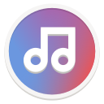
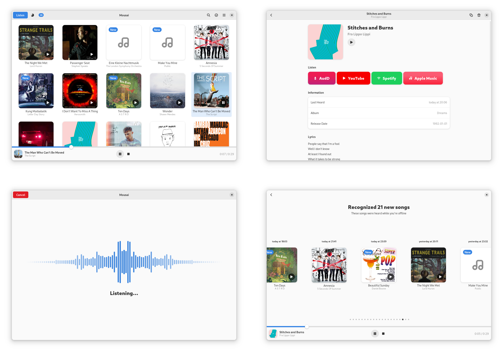

<h1 align="center">
  
  <br>
  Mousai
</h1>

<p align="center">
  <strong>Identify songs in seconds</strong>
</p>

<p align="center">
  <a href="https://flathub.org/apps/details/io.github.seadve.Mousai">
    
  </a>
  <br>
  <a href="https://seadve.github.io/donate/">
    
  </a>
</p>

<br>

<p align="center">
  <a href="https://hosted.weblate.org/engage/seadve">
    
  </a>
  <a href="https://flathub.org/apps/details/io.github.seadve.Mousai">
    
  </a>
  <a href="https://github.com/SeaDve/Mousai/actions/workflows/ci.yml">
    
  </a>
</p>

<br>

<p align="center">
  
</p>

Discover songs you are aching to know with an easy-to-use interface.

Mousai is a simple application that can recognize songs similar to Shazam. Just
click the listen button, and then wait a few seconds. It will magically return
the title and artist of that song!

Note: This uses the API of audd.io, so it is necessary to log in to their site to get more trials.

Why you will love Mousai?
* 🎵 Identify songs within seconds or save for later when offline
* 🎙️ Recognize from desktop audio or your microphone
* 🎸 Build a repertoire of recognized songs
* 🎼 Quickly preview the song within the interface
* 🌐 Browse and listen the song from different providers
* 📱 Easy-to-use user interface

## 🌈 AudD

AudD is a music recognition API that makes Mousai possible. For more information,
you can check their [Privacy Policy](https://audd.io/privacy/) and [Terms of Service](https://audd.io/terms/).

## 🏗️ Building from source

### GNOME Builder
GNOME Builder is the environment used for developing this application. It can use Flatpak manifests to create a consistent building and running environment cross-distro. Thus, it is highly recommended you use it.

1. Download [GNOME Builder](https://flathub.org/apps/details/org.gnome.Builder).
2. In Builder, click the "Clone Repository" button at the bottom, using `https://github.com/SeaDve/Mousai.git` as the URL.
3. Click the build button at the top once the project is loaded.

### Meson
```
git clone https://github.com/SeaDve/Mousai.git
cd Mousai
meson _build --prefix=/usr/local
ninja -C _build install
```

## 📦 Third-Party Packages

Unlike Flatpak, take note that these packages are not officially supported by the developer.

| Distribution |              Package Name               |                   Maintainer                    |
| :----------: | :-------------------------------------: | :---------------------------------------------: |
|     Snap     | [`mousai`](https://snapcraft.io/mousai) | [soumyaDghosh](https://github.com/soumyaDghosh) |

### Repology

You can also check out other third-party packages on [Repology](https://repology.org/project/mousai/versions).

## 🙌 Help translate Mousai

You can help Mousai translate into your native language. If you found any typos
or think you can improve a translation, you can use the [Weblate](https://hosted.weblate.org/engage/seadve/) platform.

## ☕ Support me and the project

Mousai is free and will always be for everyone to use. If you like the project and
would like to support it, you may donate [here](https://seadve.github.io/donate/).

## 💝 Acknowledgment

I would like to express my gratitude to the [contributors](https://github.com/SeaDve/Mousai/graphs/contributors)
and [translators](https://hosted.weblate.org/engage/seadve/) of the project.

I would also like to thank the open-source software projects, libraries, and APIs that were
used in developing this app, such as GStreamer, GTK, LibAdwaita, [AudD](https://audd.io/), etc., for making Mousai possible.

I would also like to acknowledge GNOME Shell whose
[issue templates](https://gitlab.gnome.org/GNOME/gnome-shell/-/tree/main/.gitlab/issue_templates)
served as the basis of Mousai's issue templates.
