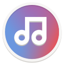
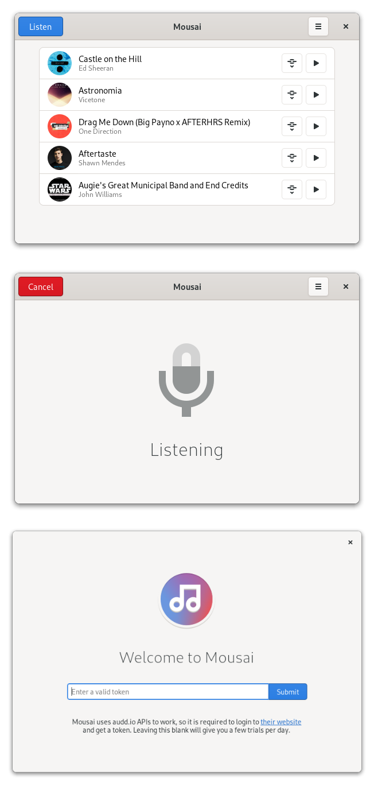

<h1 align="center">
  <br>
  Mousai
</h1>

<p align="center"><strong>Identify any songs in seconds</strong></p>

<p align="center">
  <a href="https://flathub.org/apps/details/io.github.seadve.Mousai">
    
  </a>
  <br>
  <a href="https://liberapay.com/SeaDve/donate">
    
  </a>
</p>

<br>
<p align="center">
  <a href="https://hosted.weblate.org/engage/kooha/">
    
  </a>
  <a href="https://github.com/SeaDve/Mousai/actions/workflows/testing.yml">
    
  </a>
  <a href="https://repology.org/project/mousai/versions">
    
  </a>
</p>

<p align="center">
  
</p>

Discover songs you are aching to know with an easy-to-use interface.

Mousai is a simple application that can identify songs similar to Shazam. Just
click the listen button, and then wait a few seconds. It will magically return
the title and artist of that song!

Note: This uses the API of audd.io, so it is necessary to log in to their site to get more trials.

Why you will love Mousai?
* 🎵 Identify the title and artist of the song within seconds.
* 🎸 Store the identified song including the album art in history.
* 🎼 Preview the identified song with the native player.
* 🌐 Browse the song in the web with the link.
* 📱 Easy-to-use user interface.
* ⌨️ User-friendly keyboard shortcuts.

## 🌈 AudD

AudD is a music recognition API that makes Mousai possible. For more information,
you can check their [Privacy Policy](https://audd.io/privacy/) and [Terms of Services](https://audd.io/terms/).


## 🏗️ Building from source

### GNOME Builder
GNOME Builder is the environment used for developing this application. It can use Flatpak manifests to create a consistent building and running environment cross-distro. Thus, it is highly recommended you use it.

1. Download [GNOME Builder](https://flathub.org/apps/details/org.gnome.Builder).
2. In Builder, click the "Clone Repository" button at the bottom, using `https://github.com/SeaDve/Mousai.git` as the URL.
3. Click the build button at the top once the project is loaded.

### Meson
```
git clone https://github.com/SeaDve/Mousai.git
cd Mousai
meson builddir --prefix=/usr/local
ninja -C builddir install
```


## 🙌 Help translate Mousai
You can help Mousai translate into your native language. If you found any typos 
or think you can improve a translation, you can use the [Weblate](https://hosted.weblate.org/engage/kooha/) platform.


## ☕ Support me and the project

Mousai is free and will always be for everyone to use. If you like the project and
would like to support and fund it, you may donate through [Liberapay](https://liberapay.com/SeaDve/).


## 💝 Acknowledgment

Special thanks to [AudD's API](https://audd.io/) and [contributors](https://github.com/SeaDve/Mousai/graphs/contributors) 
for making Mousai possible. Also, a warm thanks to the project's [translators](https://hosted.weblate.org/engage/kooha/).
